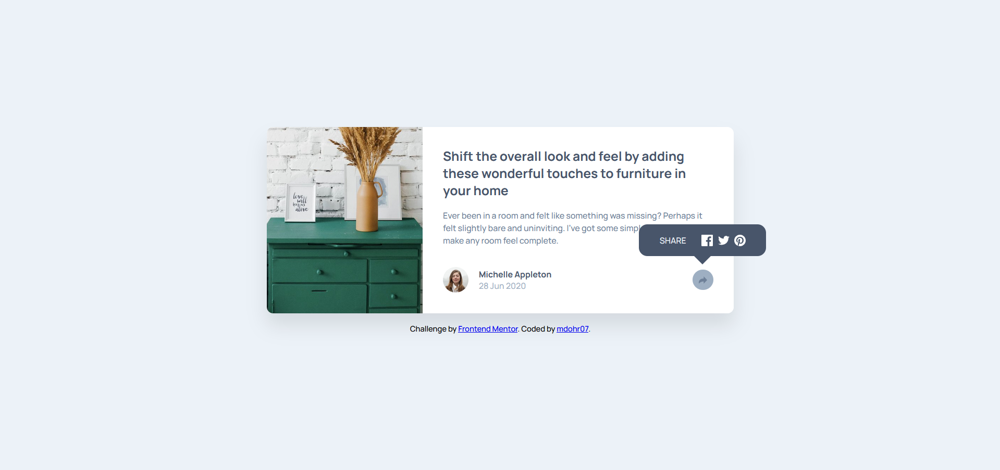

# Frontend Mentor – Article Preview Component with Share Tooltip

This is my solution to the [Article preview component challenge](https://www.frontendmentor.io/challenges/article-preview-component-dYBN_pYFT) on Frontend Mentor. It focuses on combining CSS Grid and Flexbox for layout, semantic HTML5, and a simple interactive tooltip with JavaScript.

🔗 [Live demo](https://mdohr07.github.io/Frontend-Challenges/article-preview-component/)

My version:  

*See the original on the bottom of this file*

## 🛠 Built with

- Semantic HTML5  
- CSS custom properties  
- CSS Grid & Flexbox  
- Responsive layout  
- Vanilla JavaScript  

## ✨ Extra Features Added

In addition to the original design, I added some functionality to build interactive behavior and improve accessibility.

### 🔄 JavaScript Features

- **Share button toggle**: Clicking the share icon opens and closes a tooltip with social media links.  
- **Click outside to close**: The tooltip closes when the user clicks anywhere else on the page.  
- **Positioning logic**: CSS adjustments and media queries ensure the tooltip behaves well across screen sizes.

### 📱 Responsive Adjustments

- Optimized layout for mobile, tablet, and desktop  
- Tooltip position changes based on screen width

### ♿ Accessibility Improvements

- Focus styles and hover states for interactive elements  
- Semantic elements used throughout (`<article>`, `<section>`, `<h1>`, `<time>`)  
- Optional: `aria-label`s and alt text for better screen reader support

These features helped me practice DOM event handling, CSS media queries, and responsive behavior without relying on frameworks.

---

Original Design:  

