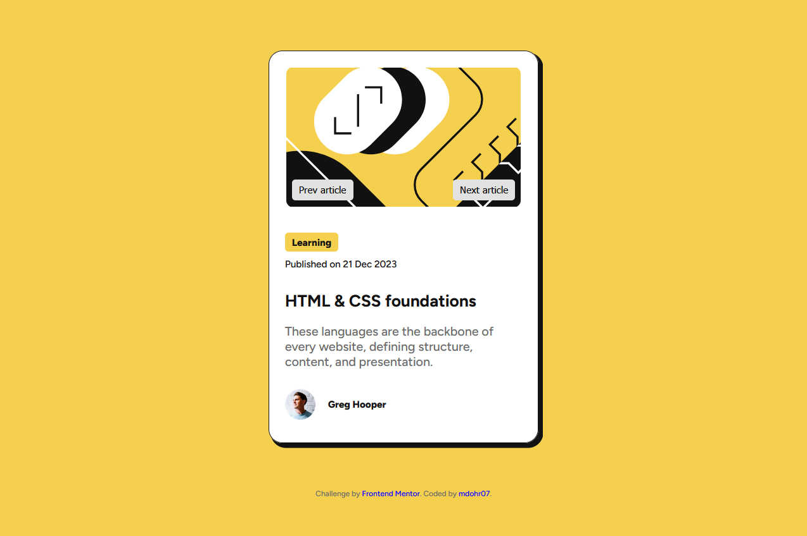

# Frontend Mentor – Blog Preview Card

This is my solution to the [Blog preview card challenge](https://www.frontendmentor.io/challenges/blog-preview-card-5Zkm4ecM) on Frontend Mentor. It focuses on structuring content semantically and using modern CSS layout techniques.

🔗 [Live demo](https://mdohr07.github.io/Frontend-Challenges/blog-preview-card/)  

My version:  

*See the original on the bottom of this file*

## 🛠 Built with love and...

- Semantic HTML5
- CSS custom properties
- Flexbox
- Responsive layout
- JavaScript

## ✨ Extra Features Added

In addition to the original challenge requirements, I added a few enhancements to push my skills:

### 🔄 JavaScript Features
- **Next & Previous buttons**: Navigate through different article cards using a simple article array and index logic.
- (Future idea: swipe gesture support)

### ♿ Accessibility Improvements
- Proper semantic elements: `<main>`, `<section>`, `<h1>`, `<time>`, etc.
- Focus styles for keyboard navigation
- Meaningful `alt` attributes for all images
- Clear link states (`hover`, `focus`, `active`)
- `aria-label`s for improved screen reader navigation (where needed)

These additions helped reinforce my understanding of DOM manipulation, accessibility best practices, and progressive enhancement.

Original Design:  

