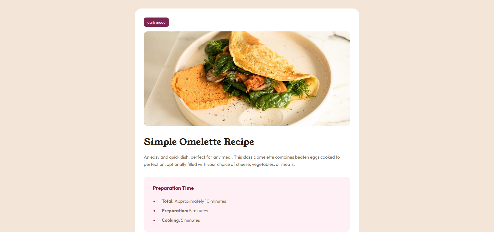

# Frontend Mentor – Recipe Page

This is my solution to the [Recipe Page challenge](https://www.frontendmentor.io/challenges/recipe-page-KiTsR8QQKm) on Frontend Mentor. The challenge focuses on semantic HTML and applying modern CSS layout and design practices.

🔗 [Live demo](https://mdohr07.github.io/Frontend-Challenges/recipe-page/) 

My version:  

*See the original on the bottom of this file*

## 🛠 Built with

- Semantic HTML5 markup  
- CSS custom properties (variables)  
- Mobile-first responsive layout  
- Flexbox  
- JavaScript  

## ✨ Extra Features Added

In addition to the required layout and styling from the original Frontend Mentor challenge, I implemented the following:

### 🌙 Dark Mode Toggle
- A **toggle button** in the top-right corner lets users switch between light and dark mode.
- The mode switch is handled with **vanilla JavaScript** and CSS class toggling.
- Button text updates dynamically to reflect the current mode (e.g., shows "light mode" when dark mode is active).
- Smooth transition effects applied with `transition` in CSS.
- Fully responsive and accessible.

### ♿ Accessibility Considerations
- Proper semantic structure (`<header>`, `<main>`, `<section>`, etc.)
- Clear color contrast in both light and dark modes
- Button is keyboard-accessible

These extras were added to make the page more interactive and to help me practice JavaScript.

Original Design:  

