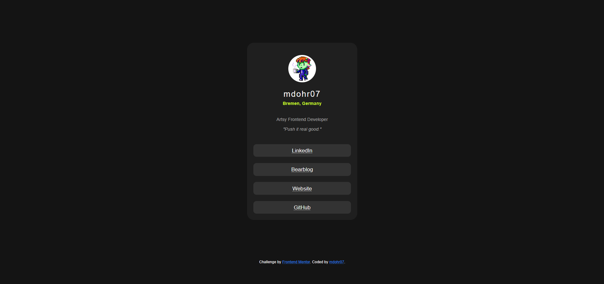

# Frontend Mentor – Social Links Profile

This is my solution to the [Social Links Profile challenge](https://www.frontendmentor.io/challenges/social-links-profile-UG32l9m6d) on Frontend Mentor. It's a clean and responsive profile card with links – perfect for practicing semantic HTML and CSS layout skills.

🔗 [Live demo](https://mdohr07.github.io/Frontend-Challenges/social-links-profile/)

My version:  

*See the original preview at the bottom of this file*

## 🛠 Built with love and...

- Semantic HTML5 markup
- CSS custom properties
- Flexbox & mobile-first design
- Local fonts via `@font-face`
- JavaScript for dynamic content
- Accessibility best practices

## ✨ Extra Features Added

In addition to the required structure and styles from the original challenge, I added:

### 💬 JavaScript Feature
- **Random quote generator**: A small JavaScript snippet displays a random, coding- or sci-fi-inspired quote on each page load.
- Encourages a creative and fun vibe while keeping the site dynamic.

### ♿ Accessibility Improvements
- Semantic tags: `<main>`, `<section>`, `<address>`, `<h1>`, and accessible image `alt` text.
- Links open in new tabs with `rel="noopener"` for security.
- Buttons replaced with `<a>` elements for correct semantics (since they navigate).

---

Original Design:  
